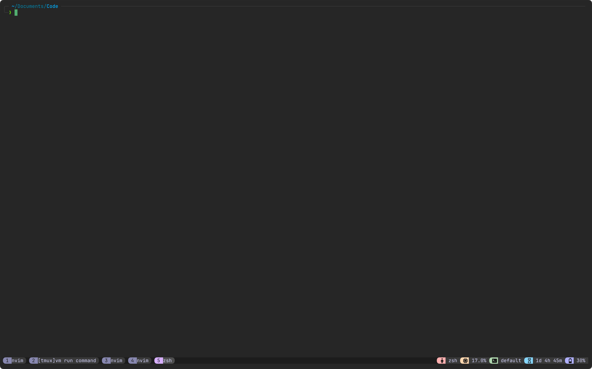
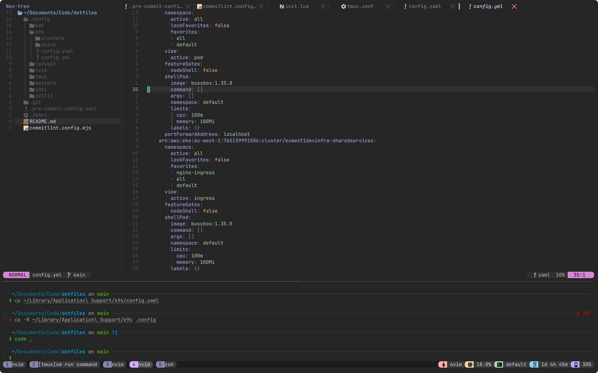

# Introduction

This repo contains the configuration files for all the command line tools that I use on a daily basis. I love [catpuccin theme](https://catppuccin.com/) and configured them in most of the tools.

## tools :hammer_and_wrench:

This is how my terminal looks :point_down:

This is how my neo-vim setup looks like

### Catpuccin theme :relaxed:

Catpuccin theme has been configured in most of the tools.

| Tool | Configration | Docs |
| --- | --- | --- |
| bat | [Config file](./.config/bat/) | [Docs](https://github.com/catppuccin/bat) |
| fzf | [Config file](./.zshrc) | [Docs](https://github.com/catppuccin/fzf) |
| k9s | [Config file](./.config/k9s/) | [Docs](https://github.com/catppuccin/k9s) |
| lazygit | [Config file](./.config/lazygit/) | [Docs](https://github.com/catppuccin/k9s) |
| nvim | [Config file](./.config/nvim/) | [Docs](https://github.com/catppuccin/nvim) |
| tmux | [Config file](./.config/tmux/)| [Docs](https://github.com/catppuccin/tmux) |
| wezterm | [Config file](./.config/wezterm/) | [Docs](https://github.com/catppuccin/wezterm) |
| yazi | [Config file](./.config/yazi/) | [Docs](https://github.com/catppuccin/yazi) |
| zellij | [Config file](./.config/zellij/) | [Docs](https://github.com/catppuccin/zellij) |

### Favourite tools :smiling_face_with_three_hearts:

- [fd-find](https://github.com/sharkdp/fd)
- [zoxide](https://github.com/ajeetdsouza/zoxide)
- [nushell](https://www.nushell.sh/)
- [eza](https://github.com/eza-community/eza)
- [ripgrep](https://github.com/raycast/ripgrep)
- [lazyvim](https://www.lazyvim.org/)
- [k9s](https://github.com/derailed/k9s) 
- [wezterm](https://wezfurlong.org/wezterm/index.html)
- [fzf](https://github.com/junegunn/fzf)
- [tmux plugin manager](https://github.com/tmux-plugins/tpm)
- [bat](https://github.com/sharkdp/bat)
- [homebrew](https://brew.sh/)

